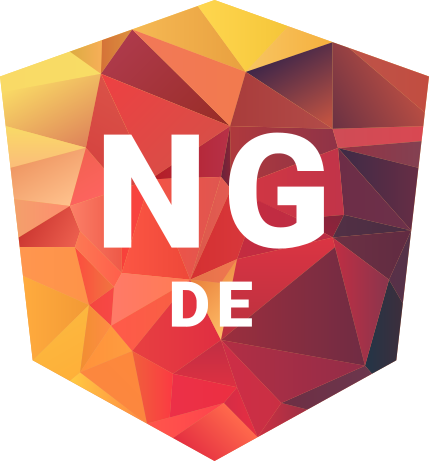

<p align="center">
   
</p>
<h1 align="center">NG-DE</h1>
<p align="center">
   Website of the <a href="https://ng-de.org" target="_blank">biggest Angular conference</a>, in Germany.
</p>

## Run website locally

> Fork this repository and clone it to your machine.

```bash
# Install dependencies
pnpm install

# Start development server
pnpm start
```

Enjoy ❤️ - your NG-DE team
