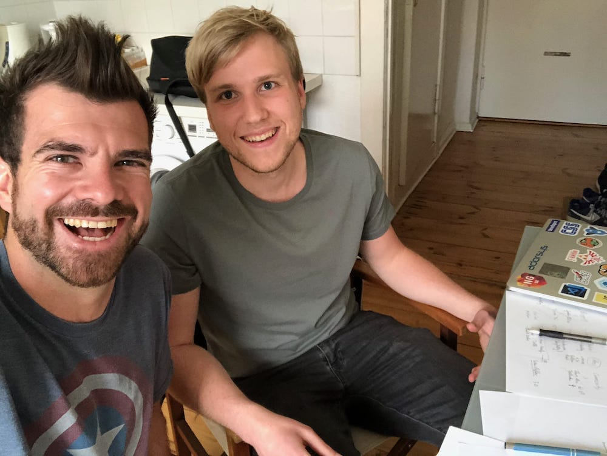
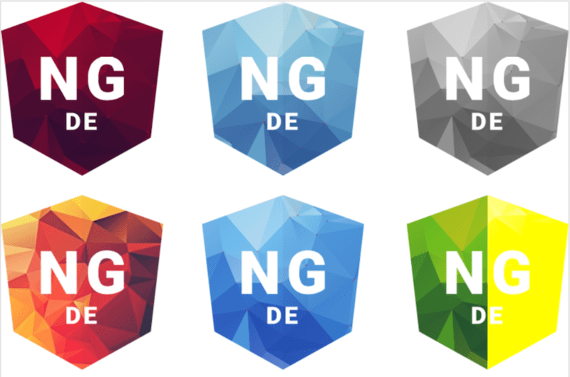

Sascha joined us nearly the first minute we started NG-DE. As we talked about the first ideas of the conference we realized fast, that the three of us (Peter, Martin, Robin) had absolutely no clue about design and how to create visuals that attract people to the conference. So Peter talked about Sascha, he’s living right next to him in Nuernberg and is a smart and creative guy that could be a good fit for our team. In his main job he is a software-developer at adorsys but with a desire to design. 

    

So in June 2018 we had our first discord call and get a chance to know each other. It was a nice chat and we all where super motivated to try to work together and we started with some iterations for our logo. We brainstormed what we want to express with the logo. We ended up with something like this:

- The base should be the angular shield
- Could we bring in the colors of the german flag + x or is it strange? 
- Maybe something in polygon style like this paper fox? Because the german-speaking community is so wonderful - diverse and build up from so many different people and pieces that fit perfectly together. 

So we did some iterations, and votings and after a while we came closer and closer to our result. One of the key voting processes where this iteration of the general direction the logo should follow.

    

As you can see, our current logo where already part of this voting process and we all loved it at first sight. After this moment we were all totally convinced that Sascha is an absolute perfect fit for the team and he created so many other wonderful things and created many many things.

We are getting so much positive feedback on our website and other designs Sascha created, that’s totally awesome and pushes us further and further to run this conference (with style, thanks to Sascha).
Just two weeks ago he also created a wonderful intro movie for the conference that announces all the speakers that will be on stage. It was a lot of work but totally worth it!

    <iframe width="560" height="315" src="https://www.youtube.com/embed/hnLcHOXmjO0" frameborder="0" allow="accelerometer; autoplay; encrypted-media; gyroscope; picture-in-picture" allowfullscreen></iframe>

We’re all thankful that you are on the team and regularly super impressed by the work you do to support this conference! Looking forward to the conference and other adventures we’ll rock together!

