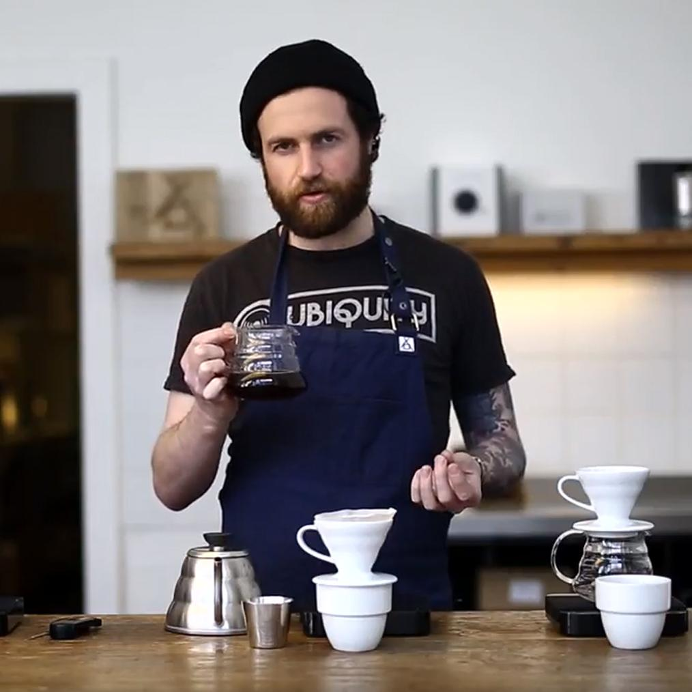
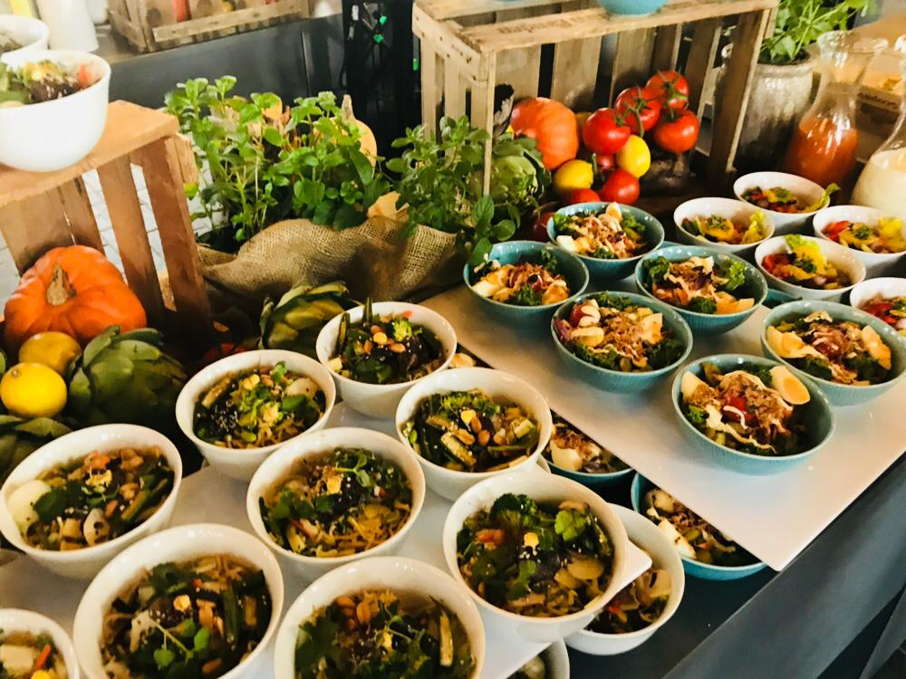
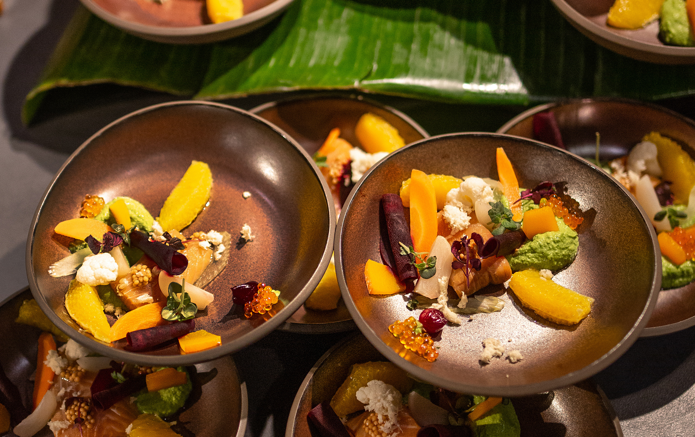

You’ve access to unlimited non-alcoholic drinks, barista coffee, and fruit baskets the whole time at our venue. Also, we provide breakfast, lunch , and dessert on both days. All menus are vegetarian and some are vegan.

If you have any special additional needs please reach out to the catering staff or some of the team members.

    

## Day 1
### Breakfast 8:30
- Coffee and tea bread rolls with different fillings
- Selection of raw vegetables 
- Vegan Bircher muesli

### Lunch 12:45
- Lamb's lettuce with apple and fried mushrooms Tomato vinaigrette (Vegetarian)
- Spicy rice bowl with bean salad, corn, fried pointed peppers and feta cheese Vadouvansud (Vegetarian)
- Berlin bowl with potato salad in yoghurt dressing, egg, pickles, green salad (Vegetarian)
- Asia bowl with Mie noodles, snow peas, shiitake mushrooms, peanuts and sesame (Vegan)

Warm toppings:
Baked mozzarella, Oven baked vegetables (vegan)

Dessert: 
Berliner Luft with raspberry, Kaiserschmarrn with plums

    

### Dessert  15:45
- Butter sugar cake from the Domberger bakery
- Strawberry curd
- hand fruit (vegan)

## Day 2
### Breakfast 8:30
- sheet cake
- Two kinds of smoothies
- hand fruit (vegan)

### Lunch 12:45
- Lettuce hearts with blueberries and tomato (Vegan)
- Quinoa bowl with raw vegetables, apple, iceberg lettuce and walnuts (Vegan)
- Oriental lentil bowl Black and red lentils, fried spinach, pumpkin, corn, popcorn (Vegan)
- Pasta bowl with pennete, zucchini, basil, tomato, parmesan, spinach salad (Vegetarian)

Warm topping:
Wedges (vegan), Mediterranean stir-fry vegetables (mushrooms, eggplant, peppers) (vegan)

Dessert: Mango apricot grits with vanilla sauce (vegan), Mousse au chocolat with sprinkles

    

### Dessert 15:15
- Honey yoghurt with chocolate crunch
- Raspberry curd slices
- hand fruit (vegan)

The whole catering is provided by the inhouse caterer of the venue. We tried consider all the notes you put in our ticket registration form. We hope you like and enjoy it!