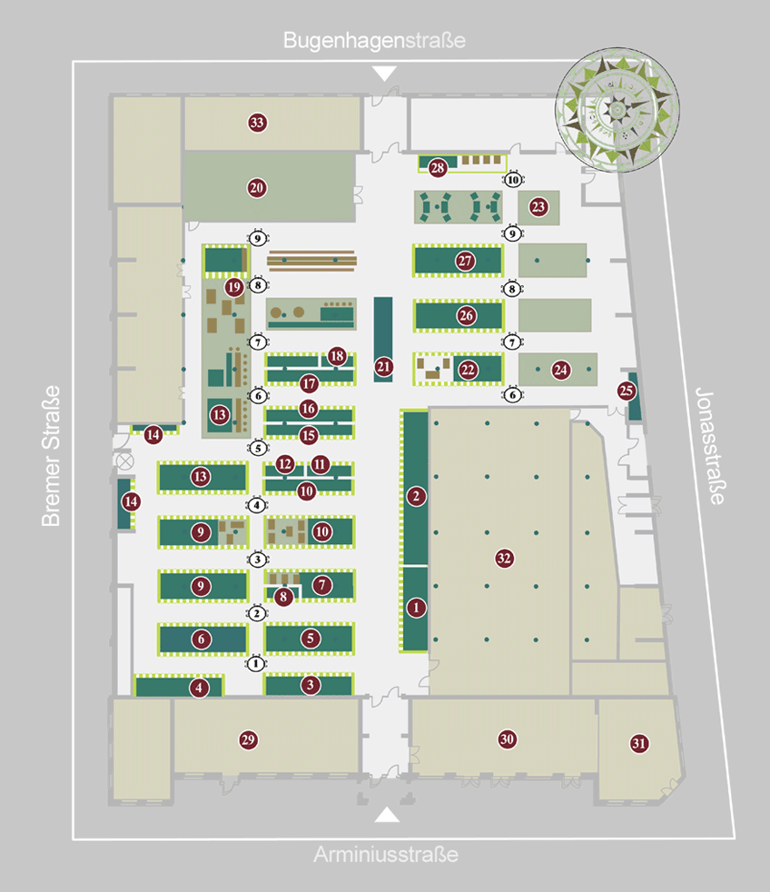

We decided to do a little Get-Together before and after the NG-DE 2022!

Now you may wonder. Get-Together? Socializing? Talking? I want all of it! But how do I get it?

- 5.10. 18:00 CEST [Arminiusmarkthalle](https://goo.gl/maps/EFAkLdMavw3pY2BS7?utm_source=NG-DE+Conference&utm_campaign=40b09c43d2-EMAIL_CAMPAIGN_2019_01_21_08_34_COPY_01&utm_medium=email&utm_term=0_a64bc22ee3-40b09c43d2-), Arminiusstraße 2-4, 10551 Berlin

You also will be available to crap you Badge already over there (so you can avoid some waiting on the next day when the conference starts)

- 6.10. 18:00 CEST [Arminiusmarkthalle](https://goo.gl/maps/EFAkLdMavw3pY2BS7?utm_source=NG-DE+Conference&utm_campaign=40b09c43d2-EMAIL_CAMPAIGN_2019_01_21_08_34_COPY_01&utm_medium=email&utm_term=0_a64bc22ee3-40b09c43d2-), Arminiusstraße 2-4, 10551 Berlin

Our meeting point will be marked with beach flags from the conference so you can't miss it.

The Arminiusmarkthalle brings together a variety of goods. Whether you are in the mood for fresh fruit after the conference or would like to eat something hearty and warm is up to you. You are sure to find something suitable at one of the numerous street food places and market booths. 

What could be better to fully experience Berlin throughout your stay?

    

Best regards

Martina, Toni, Joe, Maria, Carina, David and Robin
