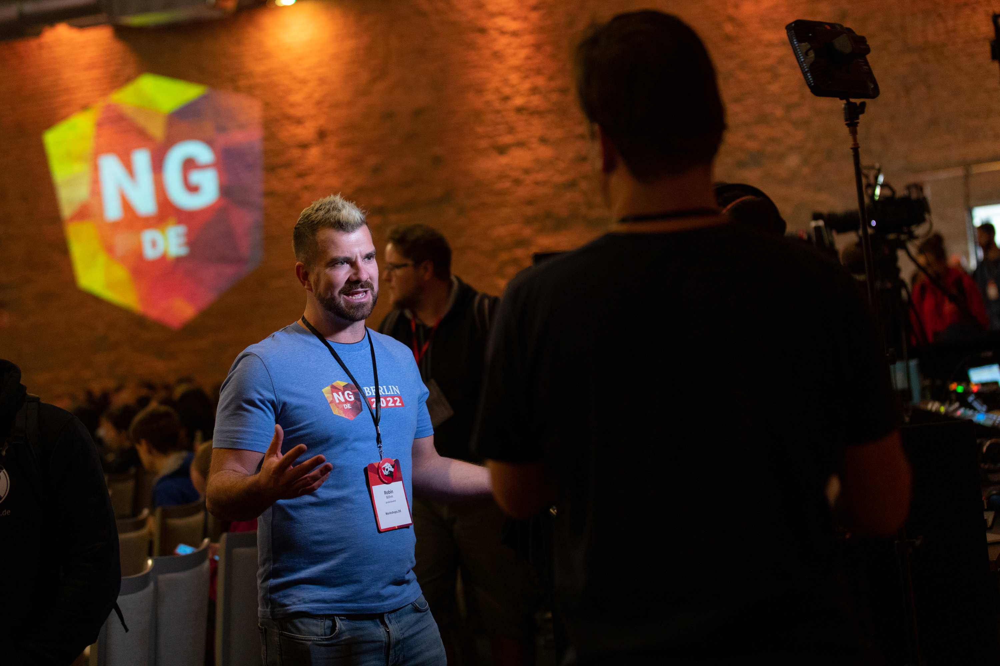
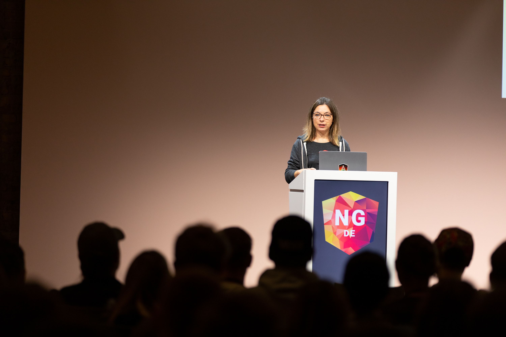

We are excited to announce a thrilling contest where you have the chance to win a ticket to the NG-DE Conference 2024!

**About the NG-DE Conference:** The NG-DE Conference is Germany's largest community-driven event for Angular developers, taking place on October 10-11, 2024, at the Maritim Hotel in Bonn. Over 800 visitors are expected, with 30 outstanding speakers and trainers and 5 engaging workshops. It's the perfect opportunity to network with other developers, learn from industry leaders, and discover the latest trends and technologies in Angular.

    

**How to participate in the contest:** We need your creativity! We are looking for a new design for the official NG-DE 2024 conference Merch (T-Shirts and Tote Bags). Submit your design and get the chance to see your work worn and sold at the conference - and win a ticket and one copy of a T-shirt!

**Contest Procedure:**

1. **Submission:** Send us your design by July 30, 2024.
2. **Pre-selection:** A jury will review all submissions and select the best designs.
3. **Community Voting:** The final decision will be made by the community through voting on our [X-channel](https://x.com/ngdeconf).
4. **Winner Announcement:** The winning design will be announced by August 15, 2024, the designer will be notified via email and will receive a ticket to the NG-DE Conference and a T-shirt!

**Participation Requirements:**

- Each participant may submit multiple designs.
- The designs must be submitted as a high-resolution image in EPS, PDF or Adobe Illustrator format (vectorized and freely scalable)
- The designs must include the logo of the conference ([NG-DE Assets](https://drive.google.com/drive/folders/1yJVr2U_-YPiUarvrTh_TqcS0Y9mWaK2H?usp=drive_link/))
- The design will be printed on a T-Shirt with the colour #005E6E so keep that in mind while you finish off your design

- By submitting, you agree to the General Terms and Conditions of the contest (see below).

We look forward to seeing your creative designs and wish all participants the best of luck!

**Your NG-DE Team**

    <a class="button button--xlarge" href="https://workshopsde.typeform.com/to/zGbBV8f5">Submit Now</a>

    

**Terms and Conditions for Submitting Designs for the Contest**

1. **Organizer**
   The contest organizer is Symetics GmbH (NG-DE and vuejs.de Conf), located at Lohmühlenstraße 65, 12435 Berlin.

2. **Eligibility**
   All natural persons aged 18 and over are eligible to participate. Employees of the organizer and their relatives are excluded from participation.

3. **Participation**
    - Participation is done by submitting a design (for a T-shirt and/or Tote Bag) via the designated Typeform
    - Multiple submissions per conference are allowed per participant.
    - The submission deadline is July 30, 2024.

4. **Design Requirements**
    - The design must be submitted as a high-resolution image in EPS, PDF, or Adobe Illustrator format (vectorized and freely scalable).
    - The designs must be original and created by the participant.
    - The design must not contain copyrighted materials or illegal, offensive, obscene, or objectionable content.

**Requirements for the NG-DE design:**
- Must include the NG-DE logo ([NG-DE Conference Assets](https://drive.google.com/drive/folders/1yJVr2U_-YPiUarvrTh_TqcS0Y9mWaK2H?usp=drive_link/))
- It may contain a slogan or image
- The logo can be modified but should retain its recognizability
- Colours can be changed

**Requirements for the Vuejs.de Conf design:**
- Must include the Vuejs.de Conf logo ([vuejs.de Conf Assets](https://drive.google.com/drive/folders/1dH8RgZsc1IdGh5uZYFv_mOPUuAJzzq3b?usp=drive_link))
- It may contain a slogan or image
- The logo can be modified but should retain its recognizability
- Colours can be changed

5. **Use of Designs**
    - By submitting, the participant transfers a simple, unlimited in time and space, right of use of the submitted design to the organizer.
    - The participant transfers the right to edit, reproduce, and use the designs in all media to the organizer.
    - The participant consents to be contacted to make any necessary changes to the design.

6. **Winner Selection**
    - After the jury initially selects the favorites, they will be shared on X (formerly Twitter), and the communities will be allowed to vote.
    - Participants are allowed to involve their communities in voting.
    - The final winning design will be chosen by a jury consisting of organizer employees.
    - Winners will be notified by email by August 15, 2024.

7. **Prizes**
    - One design will be chosen per conference, and the winner will receive a free ticket (booking code) for the conference (vuejs.de Conf or NG-DE) where their design won.
    - A T-shirt with the submitted design can be picked up on-site (shipping is not possible).
    - The organizer reserves the right to select multiple winning designs. If this includes multiple designs from one participant, only one ticket will be issued.
    - The organizer does not cover travel and accommodation at the conference location (Bonn) and must be borne by the participant.
    - A cash payout of the prize is not possible.
    - The booking code for the conference ticket may be transferred to third parties.

8. **Liability**
    - The organizer is not liable for technical disruptions that occur during the transmission of the designs.
    - The organizer assumes no liability for the accuracy, completeness, or timeliness of the provided information.

9. **Data Protection**
    - The personal data collected as part of the contest will be used exclusively for the execution of the contest and will be deleted afterwards.
    - Further information on data protection can be found in our privacy policy at:
      [NG-DE Privacy Policy](https://ng-de.org/privacy-policy)
      [vuejs.de Conf Privacy Policy](https://conf.vuejs.de/privacy-policy)

10. **Miscellaneous**
    - Legal recourse is excluded.
    - The law of the Federal Republic of Germany applies.
    - Should individual provisions of these T&Cs be or become invalid, the validity of the remaining provisions remains unaffected.

By participating in the contest, the participant agrees to these T&Cs.
